# Network Architect — actual LangGraph / DeepAgents flow

Zabbix is a configured-vendor specialist: JSON-RPC reads are direct and allowed
monitoring mutations pause at an exact-payload approval boundary.

This is the real control flow when a user asks the `network-architect` agent a
question, traced from the code (not idealized). It shows the single decision the
LLM makes (inline vs `task()` delegation), where the memory read/write hooks sit,
and where the multi-vendor path diverges.

```mermaid
flowchart TD
    U([User question]) --> RS["Rust: agent_react_code_run<br/>(commands/ai.rs)"]
    RS --> SC["Sidecar dispatch<br/>server.py: agent.react_code_loop<br/>engine=deepagents"]
    SC --> DR["deepagents_react_code_loop<br/>(deepagents_runtime.py)"]

    subgraph PREP["Pre-execute setup (deterministic, per turn)"]
        DR --> ARCH{"is_architect?"}
        ARCH -->|yes| BUILD["build_architect_direct_tool(user_msg)<br/>binds ALL configured vendors<br/>into ONE execute_python_code sandbox<br/>(~9,200 tok description)"]
        ARCH -->|yes| SUBS["build_vendor_subagents()<br/>one SubAgent per vendor<br/>→ exposed as task() tool"]
        ARCH -->|no| ONE["create_execute_python_code_tool<br/>(single vendor sandbox)"]
        BUILD --> HINT["architect_routing_hint(user_msg)<br/>detect_vendor_ids → 0/1/many<br/>'thumb on the scale' nudge"]
        HINT --> MSG["_build_input_messages<br/>+ READ HOOK: recall_context_message<br/>injects ESTABLISHED CONTEXT turn<br/>(facts for named entities)"]
        ONE --> MSG
        MSG --> GRAPH["create_deep_agent(...)<br/>builds LangGraph:<br/>model + tools + middleware<br/>(RubricMiddleware, Sanitizer)"]
    end

    GRAPH --> STREAM["run_and_stream<br/>graph.astream(subgraphs=True)<br/>(deepagents_stream.py)"]

    STREAM --> LLM1["LLM turn:<br/>reads system prompt + tool desc<br/>+ ESTABLISHED CONTEXT + routing hint"]

    LLM1 --> DECIDE{"LLM decides<br/>(soft, prompt-driven —<br/>NOT enforced by code)"}

    DECIDE -->|"single platform<br/>OR simple multi"| INLINE["INLINE PATH<br/>orchestrator's own sandbox"]
    DECIDE -->|"multi-vendor<br/>correlation"| TASK["task() DELEGATION<br/>spawns vendor subagents"]

    subgraph INLINEBOX["Inline (Path A) — ~2 LLM calls"]
        INLINE --> EPC["execute_python_code(code)"]
        EPC --> SBX["_build_sandbox_globals<br/>meraki_api_call, cml_api_call, …<br/>all pre-bound"]
        SBX --> MEMO["api_memo: in-turn GET dedup"]
        MEMO --> CAP["WRITE HOOK: install_autocapture<br/>wraps every *_api_call →<br/>persists ids/topology to graph_facts"]
        CAP --> API1[("Vendor APIs<br/>Meraki / CML / ISE / …")]
    end

    subgraph TASKBOX["Delegation (Path B) — ~5-6 LLM calls, parallel"]
        TASK --> SA1["meraki-specialist<br/>own focused sandbox<br/>(~670 tok prompt)"]
        TASK --> SA2["cml-specialist"]
        TASK --> SA3["…-specialist"]
        SA1 --> API2[("Meraki API")]
        SA2 --> API3[("CML API")]
        SA1 --> SYNTH["orchestrator correlates<br/>specialist results"]
        SA2 --> SYNTH
        SA3 --> SYNTH
    end

    API1 --> RUBRIC{"RubricMiddleware<br/>'is the task actually done?'"}
    SYNTH --> RUBRIC
    RUBRIC -->|"not satisfied"| LLM1
    RUBRIC -->|"satisfied"| FINAL["final answer<br/>+ diagram events streamed"]
    FINAL --> POST["POST-TURN: distill_and_store<br/>(agent-lessons: error→recovery)"]
    POST --> OUT([Answer + diagram to user])

    style CAP fill:#d5e8d4,stroke:#82b366
    style MSG fill:#d5e8d4,stroke:#82b366
    style POST fill:#d5e8d4,stroke:#82b366
    style DECIDE fill:#ffe6cc,stroke:#d79b00
    style RUBRIC fill:#ffe6cc,stroke:#d79b00
    style BUILD fill:#f8cecc,stroke:#b85450
```



**Green** = memory hooks (deterministic — read before, write during, lessons after).
**Orange** = LLM decision points (the model chooses, not the code).
**Red** = the ~9,200-token description that buries memory-first on the inline path.

## Key facts this reflects (verified live 2026-07-17)

- The **inline vs delegation choice is the LLM's**, steered only by the AGENT.md
  prompt + routing hint — the code builds *both* paths every turn.
- A **cross-vendor question** (Meraki + CML inventory) took **Path B**:
  the architect fired `task()` twice, spawning `meraki`/`cml` (and an unasked
  `pyats`) specialist sandboxes, then correlated — 355s, 17 tool calls.
- **Single-vendor** questions take Path A (inline, ~2 calls).
- Memory **write** works on both paths (the hook wraps every `*_api_call`).
  Memory **read** (ESTABLISHED CONTEXT) is injected once for the orchestrator;
  a spawned subagent starts its own context and does not inherit it.
```
